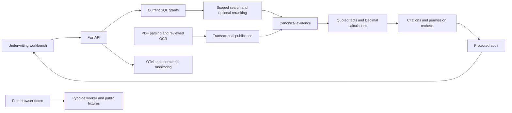

# CreditLens

CreditLens helps commercial-loan underwriters connect borrower evidence to the applicable lending policy. Ask a question, select a borrower and policy date, then inspect an evidence packet containing cited facts, financial calculations, missing documents, conflicts and next actions. The underwriter retains the lending decision.

[Interactive demo](https://huggingface.co/spaces/chinmayarvind/creditlens) · [Documentation](docs/README.md) · [Local setup](#setup)

[](https://huggingface.co/spaces/chinmayarvind/creditlens)

## Why it helps

Underwriting evidence is spread across financial statements, debt schedules and changing policy documents. A relevant passage can still belong to the wrong borrower or policy version. CreditLens brings scoped evidence and its source pages into the same workbench, makes missing inputs visible and keeps financial arithmetic reproducible.

The demo uses fictional documents and runs the Python workflow inside your browser. After startup, questions and source inspection work offline. Try **“What is the borrower's DSCR?”**, then open the citations or select a borrower with missing debt-service evidence.

## Key features

- Permission-aware retrieval with borrower, tenant, access-group and effective-date filters.
- Page-level citations tied to canonical text, document versions and exact source spans.
- Decimal financial calculations, explicit abstention, conflict detection and exception guidance.
- Optional hybrid retrieval, semantic chunking, selective query grounding and reranking.
- Response caching with fresh authorization and audit records; optional shared request quotas.
- Durable document ingestion with worker leases, atomic publication and reviewed OCR quarantine.
- Retrieval tracing, operational dashboards and executable evaluation and regression checks.

## Setup

Install Git, Python 3.11, uv and Bun 1.3.10. The local synthetic demo needs no cloud credentials.

```powershell
git clone https://github.com/chinmayarvind23/credit-lens.git
cd credit-lens
uv sync --locked
cd apps/web
bun install --frozen-lockfile
bun run build
cd ../..
uv run --no-sync uvicorn creditlens.api:create_app --factory --host 127.0.0.1 --port 8000
```

Open [the workbench](http://127.0.0.1:8000) or [API documentation](http://127.0.0.1:8000/docs). Configuration is documented in [.env.example](.env.example). See [commands](docs/commands.md) for checks and [evaluation usage](evals/README.md) for reproducible runs.

## Tech stack

| Area | Technologies and role |
| --- | --- |
| Application | Python, FastAPI, Pydantic and SQLAlchemy; Decimal for financial arithmetic |
| Workbench | TypeScript, HTML, CSS and Bun; Pyodide for the interactive Hugging Face browser deployment |
| Retrieval | Lexical search by default; optional LlamaIndex chunking, Sentence Transformers embeddings and cross-encoder reranking, OpenSearch and Snowflake Cortex adapters |
| State and ingestion | SQLite for the demo, PostgreSQL for canonical state, Redis caching and quotas, pypdf, PaddleOCR and an SQS-compatible local queue adapter |
| Quality and operations | DeepEval/RAGAS runners, OpenTelemetry, Prometheus, Grafana, pytest, Ruff and mypy |
| Additional service paths | gRPC, read-only GraphQL and an optional public Supabase directory |
| Retrieval and processing tools | FAISS and Weaviate comparison tools; PySpark metadata backfill |
| Deployment | Free Hugging Face hosting; Docker and optional AWS Terraform configuration |

The browser uses public fictional evidence and lexical retrieval. Optional server adapters and laboratory tools are enabled separately through their setup guides.

## How it works

The server resolves the caller's current grants and selects evidence within their borrower and policy scope. Search supplies candidates; canonical storage supplies the text and authority. The workflow selects the relevant passages, computes supported financial values and builds an extractive evidence packet. Before returning it, the server validates citations, rechecks permissions and writes a protected audit record. Opening a source repeats authorization.



The public browser bundles only fictional data. Use the authenticated server architecture for protected documents. See [system design](docs/system-design.md) and [security](docs/security.md).

## Deployment

The [interactive Hugging Face build](infra/huggingface/browser/DEPLOYMENT.md) is self-contained and uses free hosting. [Optional AWS instructions](infra/aws/README.md) describe an operator-managed deployment. AWS is not needed to run the project; operators choose and fund their own infrastructure.

## Improvements with more time

- **Product:** Work with underwriters on document-request workflows, clearer exception review and more varied source documents.
- **Architecture:** Extend governed deployment and worker isolation around the same canonical authorization boundary.
- **Engineering and scalability:** Expand independent evaluation, exercise larger workloads and recovery scenarios, and use those observations to guide caching and worker-capacity changes.
