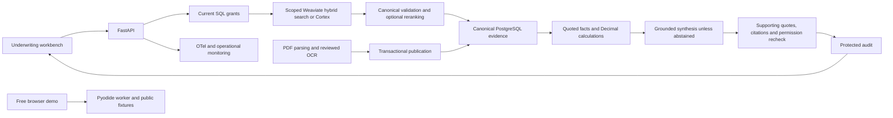

# CreditLens

CreditLens helps commercial-loan underwriters connect borrower evidence to the applicable lending policy. Ask a question, select a borrower and policy date, then inspect an evidence packet containing cited facts, financial calculations, missing documents, conflicts and next actions. The underwriter retains the lending decision.

[Interactive demo](https://huggingface.co/spaces/chinmayarvind/creditlens) · [Documentation](docs/README.md) · [Local setup](#setup)

[](https://huggingface.co/spaces/chinmayarvind/creditlens)

## Why it helps

Underwriting evidence is spread across financial statements, debt schedules and changing policy documents. A relevant passage can still belong to the wrong borrower or policy version. CreditLens brings scoped evidence and its source pages into the same workbench, makes missing inputs visible and keeps financial arithmetic reproducible.

The demo uses synthetic documents and runs the Python workflow inside your browser. After startup, questions and source inspection work offline. Try **“What is the borrower's DSCR?”**, then open the citations or select a borrower with missing debt-service evidence.

## Key features

- Permission-aware retrieval with borrower, tenant, access-group and effective-date filters.
- Page-level citations tied to canonical text, document versions and exact source spans.
- Decimal financial calculations, explicit abstention, conflict detection and exception guidance.
- Persistent Weaviate vector search for the authenticated server, with configurable OpenSearch lexical retrieval, rank fusion, query grounding and local reranking.
- Grounded synthesis from a pinned Ollama model, with adjacent citations and exact supporting quotes for review.
- Response caching with fresh authorization and audit records; optional shared request quotas.
- Durable document ingestion with worker leases, atomic publication and reviewed OCR quarantine.
- Retrieval tracing, operational dashboards and executable evaluation and regression checks.

## Setup

Install Git, Python 3.11, uv and Bun 1.3.10. The local synthetic demo needs no cloud credentials.

```powershell
git clone https://github.com/chinmayarvind23/credit-lens.git
cd credit-lens
uv sync --locked
cd apps/web
bun install --frozen-lockfile
bun run build
cd ../..
uv run --no-sync uvicorn creditlens.api:create_app --factory --host 127.0.0.1 --port 8000
```

Open [the workbench](http://127.0.0.1:8000) or [API documentation](http://127.0.0.1:8000/docs). Configuration is documented in [.env.example](.env.example). See [commands](docs/commands.md) for checks and [evaluation usage](evals/README.md) for reproducible runs.

## Technology

**Python · FastAPI · Pydantic · SQLAlchemy · TypeScript · PostgreSQL · Weaviate · OpenTelemetry**

Python and FastAPI expose the underwriting service, Pydantic validates its contracts,
and SQLAlchemy manages canonical evidence and application state. PostgreSQL supports
server persistence; Weaviate stores searchable embeddings, Ollama generates cited interpretation, and Redis supports shared caching. TypeScript and Bun power the workbench,
while OpenTelemetry traces retrieval and service operations. The browser demo runs Python
through Pyodide with SQLite, public synthetic evidence and lexical retrieval.

### Integrations

Configure the integrations your deployment needs:

- **Retrieval and document processing:** LlamaIndex for chunking, Sentence Transformers
  for model-based retrieval and reranking, [Weaviate](docs/weaviate.md), [Snowflake Cortex](infra/cortex/README.md)
  and [OpenSearch](infra/opensearch/README.md) for search integrations, and
  [reviewed OCR](infra/ocr/README.md) for document ingestion.
- **Generation:** [Ollama](docs/generation.md) serves an installed local model pinned by tag and digest.
- **Evaluation and monitoring:** DeepEval and RAGAS for evaluation, with Prometheus
  and Grafana for operational monitoring.
- **Interfaces and delivery:** [SQS-compatible messaging](infra/sqs/README.md) for
  ingestion delivery, plus [gRPC](infra/rpc/README.md) and
  [GraphQL](docs/graphql-admin.md) for service and inspection interfaces.
- **Hosting and infrastructure:** Hugging Face Spaces for the browser demo, Docker
  for service packaging, [Supabase](infra/supabase/README.md) for a PostgreSQL
  integration and [AWS Terraform](infra/aws/README.md) for operator-managed infrastructure.
- **Metadata processing:** [Spark/PySpark](infra/spark/README.md) validates and prepares scoped index metadata.

Server services, model-based retrieval and [grounded synthesis](docs/generation.md) are configured separately from the browser demo.
See [system design](docs/system-design.md) for component boundaries and
[deployment setup](docs/deployment.md) for hosting and infrastructure configuration.

## How it works

The server resolves the caller's current grants and selects evidence within their borrower and policy scope. The production server can combine Weaviate vector search with lexical ranks and local reranking, or use Cortex Search. PostgreSQL supplies the canonical text and authority. The workflow selects relevant passages and computes supported financial values. When evidence supports an answer, a pinned Ollama model adds generated interpretation with exact supporting quotes; server-abstained packets skip generation. The reviewer sees that interpretation alongside the deterministic assessment. Before returning the packet, the server validates citations, rechecks permissions and writes a protected audit record. Opening a source repeats authorization.



The public browser bundles only synthetic data. Use the authenticated server architecture for protected documents. See [system design](docs/system-design.md) and [security](docs/security.md).

## Deployment

The [interactive Hugging Face build](infra/huggingface/browser/DEPLOYMENT.md) is self-contained and uses free hosting. [Optional AWS instructions](infra/aws/README.md) describe an operator-managed deployment. AWS is not needed to run the project; operators choose and fund their own infrastructure.
