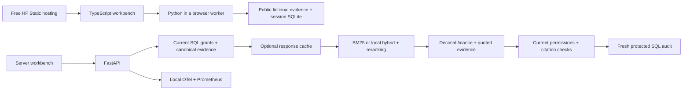

# CreditLens

**Lending evidence with page-level citations, deterministic calculations and permission checks.**

[Open the interactive demo](https://huggingface.co/spaces/chinmayarvind/creditlens)

[](https://huggingface.co/spaces/chinmayarvind/creditlens)

Select a fictional borrower, ask a question, change the policy date and open the cited pages. The
free Hugging Face demo runs the Python evidence engine in your browser. It needs no API key, backend
connection, tunnel or running owner computer. After startup, queries and source inspection work
offline. The first load downloads about 18 MB of runtime assets from Hugging Face.

## Why this exists

An underwriter needs to connect borrower facts to the right policy version. A relevant answer can
still be wrong if it uses another borrower's document, overlooks a missing debt schedule or divides
incompatible financial inputs. CreditLens prepares an evidence packet with source quotes, financial
metrics, missing inputs, contradictions, exceptions and next actions. The underwriter makes the
lending decision.

The server resolves current grants before retrieval, filters tenant/borrower/ACL/date scope,
computes DSCR with Decimal, checks exact citations, rechecks permissions and persists an audit
before returning a packet. Passing a DSCR threshold does not approve a loan or establish compliance
with every policy requirement.

## What works

- Questions, borrower selection, historical policy dates and exact source inspection.
- Deterministic DSCR, missing-input abstention, conflicting-source detection and exceptions.
- FastAPI server with current SQL grants, tenant/ACL filters and protected audit records.
- Optional local hybrid retrieval, cross-encoder reranking and selective query grounding.
- Bounded full-response caching with fresh authorization, citations, request IDs and audits.
- Optional Redis retrieval caching, shared fail-closed query quotas and a PostgreSQL canonical catalog.
- Durable digital-PDF ingestion, fenced worker leases, atomic publication and SQS-compatible notifications.
- Optional trusted Windows OCR worker with verified EOS completion, durable quarantine, scoped review and retained provenance.
- Local OTel traces, Prometheus metrics, security/regression tests and CI quality/latency gates.
- Provisioned [local Grafana dashboards](infra/monitoring/README.md) for actual synthetic API traffic, latency, errors, cache hits and dispositions.
- Actual DeepEval and RAGAS runners using a local judge; validation limits are listed below.
- Optional versioned [gRPC transport](infra/rpc/README.md) reusing current identity, quotas and audited packets.
- Optional read-only [GraphQL admin inspection](docs/graphql-admin.md) for catalog, jobs and own audit metadata.
- Optional [Supabase public directory](infra/supabase/README.md) for fictional borrower labels, with read-only RLS and bundled offline fallback.

## Measured results

| Measurement | Result | Scope |
| --- | --- | --- |
| Corpus and evaluation set | 3,840 physical pages, 203 PDFs, 240 questions | Synthetic, authored and exposed during development |
| Lexical retrieval | Recall@10 74.05%, nDCG@10 .6775 | 220 eligible questions; unchanged in the latest full replay |
| Hybrid + reranking + selective query grounding | Recall@10 86.54%, nDCG@10 .7878 | Local composed workflow; separate from the browser's lexical mode |
| Structured workflow outcomes | 240/240 fixture passes | Deterministic checks, not semantic groundedness |
| Response cache, disabled / warm | HTTP p95 23.14 / 22.67 ms (repeat) | 150 requests per mode, serial loopback, disk audit and telemetry enabled |
| Cache variability | 18.35% first run; 2.04% repeat | Same five-borrower workload; 330 distinct audits per run including warmups |
| Custom RAGAS field support | 2,963/2,965 supported field occurrences | All 235 returned packets; 441 actual local judgments, one arithmetic false negative shared by two fields |
| Separate-process HTTP load | 300 measured requests; p95 86 / 99 / 300 ms at concurrency 1 / 4 / 8 | Two servers, shared PostgreSQL, equal packets and 360 distinct audits including follow-up checks |
| Public browser verification | 12 checks passed | Desktop/mobile, all five dispositions, sources and questions with network disabled after startup |

Cache gains varied across runs on this shared workstation; a reliable production speedup is not
established. The response-cache comparison preserves every substantive packet field and creates a
fresh audit for every request. These timings do not establish production latency or cloud cost
savings. The corpus uses 98 short templates and is not a real lender dataset.

Requested targets of 94.1% recall, .89 nDCG, 96.8% semantic citation precision, 92.5% grounded
answers and 1.7% unsupported claims are **not established results**. DeepEval/RAGAS are integrated.
Full-population cited-field support is complete, with all 240 cases accounted for, including five
access denials. Whole-packet DeepEval v2 also completed offline reconciliation: 102/235 raw packet
passes (43.4%) and 8/8 frozen controls. The result is a diagnostic, not reliable project accuracy:
agent review found disputed judge failures, and both human calibration and validated project quality
remain false. Recovery retained 192 completed judgments and added 43 previously unstarted
empty-evidence cases; no completed verdict was replaced. The 970 operational/advice/question fields
outside the narrower RAGAS rubric are now assessed within the separate packet rubric, not
retroactively added to the field-support denominator. See [evaluation
definitions](docs/evaluation.md) and [judge runners](infra/evaluation/README.md).

## Run the server locally

Use Git, Python 3.11, uv and Bun 1.3.10. The synthetic demo needs no cloud credentials. Use a Git
checkout because evaluation provenance records the source commit.

```powershell
git clone https://github.com/chinmayarvind23/credit-lens.git
cd credit-lens
uv sync --locked
cd apps/web
bun install --frozen-lockfile
bun run build
cd ../..
uv run --no-sync uvicorn creditlens.api:create_app --factory --host 127.0.0.1 --port 8000
```

Open http://127.0.0.1:8000 and http://127.0.0.1:8000/docs. For the free browser deployment, follow
the [build and publish guide](infra/huggingface/browser/DEPLOYMENT.md).

To enable response caching and local telemetry:

```powershell
uv sync --locked --extra observability
$env:CREDITLENS_RESPONSE_CACHE_ENABLED = 'true'
$env:CREDITLENS_TELEMETRY_ENABLED = 'true'
$env:CREDITLENS_TRACE_FILE = 'C:/private/creditlens/traces.jsonl'
uv run --no-sync uvicorn creditlens.api:create_app --factory --host 127.0.0.1 --port 8000
```

Choose your own private trace directory. Traces contain stage timing and correlation, not questions,
documents, tokens or borrower identities. `/api/v1/metrics` requires a current admin grant.
[Observability](docs/observability.md) explains the exporter and metrics.

Optional service instructions: [hybrid retrieval](infra/retrieval/README.md),
[Redis](infra/redis/README.md), [PostgreSQL and digital ingestion](infra/postgres/README.md),
[SQS-compatible workers](infra/sqs/README.md), [reviewed OCR ingestion](infra/ocr/README.md).

## Architecture



Both deployments reuse the Python workflow. The browser distributes only public fictional pages; its
scope checks cannot protect confidential assets against the visitor. The authenticated server is the
path for protected data. The [governed Cortex runtime](infra/cortex/README.md) composes the existing
authenticator, PostgreSQL catalog and Cortex adapter. Local contract verification is distinct from a
live managed deployment, which remains unverified. The public demo must never accept real borrower
files.

The stack is Python, FastAPI, Pydantic, SQLAlchemy, Decimal, TypeScript and Bun; Pyodide for the
free demo; optional LlamaIndex, Sentence Transformers, Redis, PostgreSQL, OpenSearch, SQS,
DeepEval/RAGAS, OTel, Prometheus, Grafana, FAISS, Weaviate, Spark, gRPC, GraphQL and a public
Supabase directory for local experiments and service paths. Kubernetes is not used.

## Checks and reproduction

```powershell
uv sync --locked --extra queue --extra retrieval --extra observability --extra admin
uv run --no-sync ruff check src
uv run --no-sync ruff format --check src
uv run --no-sync mypy src
uv run --no-sync pytest tests infra/huggingface/tests .github/tests --ignore=tests/test_retrieval_lab.py
uv run --no-sync python -m scripts.benchmark_response_cache --output ../creditlens-http-results
```

The benchmark records actual HTTP responses, packet equality, unique audits, local traces, metrics,
source hashes and a 2.7-second p95 ceiling. Its observed latency is reported independently of that
ceiling. CI also runs the frozen 240-question retrieval/security regression gate and coverage
checks. Hosted CI is manual-dispatch only under the no-spending constraint; local checks do not
imply a hosted run.

The [Spark backfill benchmark](infra/spark/README.md) compares serial Python and local PySpark with
exact output-equivalence checks.

The [Weaviate HNSW comparison](infra/weaviate/README.md) records four local configurations,
authorization checks and measured tradeoffs.

The [scoped FAISS benchmark](docs/faiss-benchmark.md) retains approximate and exact neighbor IDs for
independent ANN agreement checks.

The [multi-instance load report](docs/multi-instance.md) records concurrent HTTP, shared audits and
revocation. That historical run used process-local quotas; [shared Redis
enforcement](infra/redis/README.md) has separate 24-test evidence. A [database restore
drill](docs/recovery.md) preserves 330 canonical rows, audits and snapshot revocations; newer
revocations require reconciliation before reopening.

The [clean release verification](docs/release-verification.md) records a fresh installation,
frontend build, documented tests and actual HTTP checks.

Local monitoring provisions 20 operational, six evaluation and six indexing panels. Runtime cost
metrics distinguish known from unknown values. The local indexing snapshot acknowledged 3,840 chunks
in 0.957 seconds and observed one canary after 0.990 seconds; this does not establish production
capacity or full-index freshness. See [monitoring](infra/monitoring/README.md) and
[evaluation](docs/evaluation.md) for observed token counts, dashboard checks and measurement limits.

## Optional AWS setup

The demo is hosted on Hugging Face's free plan. AWS is optional, has not been provisioned, and is
not required to use or develop CreditLens. The [AWS setup guide](infra/aws/README.md) covers the
Docker image, IAM bootstrap, Terraform plan, `us-east-1`, health checks, cost considerations and
teardown for operators who choose their own deployment. That reference is not guaranteed free.

## Remaining work and tradeoffs

The working demo is a prototype, not a finished production lending system. The main gaps are a
calibrated full semantic benchmark, more diverse documents and unseen questions, sandboxed public
OCR ingestion, live governed search/identity integrations and production operations. Response caches
remain per process; shared Redis quotas and PostgreSQL authority have local contention/recovery
evidence. LangSmith/CloudWatch and managed dashboards are not deployed. None of these planned
components are presented as running services.

The modular monolith keeps permission checks and audit close to evidence generation. That makes the
current workflow easier to verify; a larger ingestion workload may justify stronger worker isolation
and measured capacity changes before adding more service boundaries.

## Documentation

[Delivery reference](docs/delivery.md) collects the demo, implementation evidence, setup and
verification results.

[Original stack and evidence](docs/stack-evidence.md) maps each resume technology to its actual role
and verification limits.

[System design](docs/system-design.md) | [HLD](docs/HLD.md) | [LLD](docs/LLD.md) |
[Security](docs/security.md) | [Evaluation](docs/evaluation.md) | [Performance](docs/performance.md)
| [Deployment](docs/deployment.md)

Raw evidence, architecture decisions, the blog draft, interview notes and recordings are maintained
outside the repository in `resources/credit_lens`.
