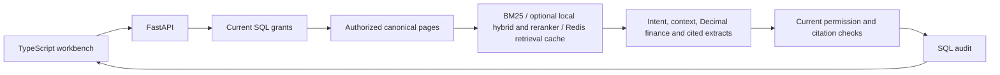

# CreditLens

**Permission-aware lending evidence for human review**

Implementation is in progress. The [live workbench](https://huggingface.co/spaces/chinmayarvind/creditlens)
accepts questions, borrower selection and policy dates, and opens cited sources.
Hugging Face serves the entry page; the API runs on the owner's computer through
a free HTTPS tunnel. The computer, Docker and tunnel must stay running. Live AWS, Cognito and Snowflake
integration, scanned-document ingestion and semantic answer evaluation remain unfinished.

[](https://huggingface.co/spaces/chinmayarvind/creditlens)

The animation records a live synthetic query and source inspection. Open the
workbench to enter your own question.

CreditLens helps commercial-loan underwriters assemble policy-grounded borrower evidence, deterministic financial metrics, missing-document checks, policy exceptions, conflicts, and recommended next actions with page-level citations. The final lending decision remains human-controlled.

Incorrect borrower scope, stale policy or unsupported arithmetic can invalidate
an otherwise relevant answer. CreditLens filters current tenant, borrower, ACL and
effective-date scope before ranking, checks exact cited evidence, computes DSCR
with Decimal and records an audit before returning a packet. A passing synthetic
DSCR threshold does not approve a loan or establish compliance with every policy.

## Measured local evidence

| Experiment | Result | Scope |
| --- | --- | --- |
| Corpus | 3,840 physical pages, 203 PDFs | 200 synthetic borrowers, three policy versions; 98 templates and short pages limit diversity |
| Lexical control | Recall@10 74.05%, nDCG@10 .6775 | 220 positive-qrel cases from 240 exposed authored questions |
| Local hybrid + reranker | Recall@10 82.55%, nDCG@10 .7291 | Composed serving provider reproduces the prior experiment's top ten exactly on all 240 cases |
| Structured fixture outcomes | 212/240 initially, 240/240 after intent/topic checks | Also reproduced through the composed model workflow; semantic groundedness remains unmeasured |
| Complete HTTP, cache disabled | p95 18.13 ms | 330-page demo, 150 serial loopback requests, disk-backed SQLite audit |
| Complete HTTP, warm Redis | p95 19.87 ms | Same workload, 150 hits; cache was slower and remains optional |

The requested 94.1% recall, .89 nDCG, 96.8% semantic citation precision, 92.5%
groundedness, 1.7% unsupported claims, 13.4-point quality gain and cloud latency/cost
improvements remain targets. Exact excerpt checks and synthetic fixture passes
do not establish semantic metrics or real lending impact. Evaluation definitions
are in [evaluation documentation](docs/evaluation.md); private raw runs and failure
records are maintained outside this repository.

DeepEval now has an [isolated local judge runner](infra/evaluation/README.md).
The first two local judges failed screening. Qwen3 8B then passed twelve frozen
supported/contradicted controls covering amounts, entities, dates, missing evidence,
currency and approval authority. This is authored screening, not a project quality
score. Actual packet pilots then exposed omitted fields, incomplete generation
and incorrect verdicts on valid calculations. The judge is not validated for
project quality claims. RAGAS, human calibration and the full semantic baseline
remain open.

The optional neural runtime passed real loopback HTTP checks for five financial
scenarios, exact source access, denied scope, abstention, overload and revocation,
with no observed external connections. Its complete local suite passes 440 tests
with 98.51% core statement coverage. The Linux CPU container reproduced all 240
rankings and fixture outcomes with network access disabled. That verified model
container now serves the public Space; its actual HF page passed desktop and
mobile browser checks. The UI's `local-extractive` label describes quoted answer
assembly, while protected audit records identify hybrid retrieval and reranking.

## Run locally

Use Python 3.11, uv and Bun 1.3.10. No cloud credentials are required for the demo.

```powershell
uv sync --locked
cd apps/web
bun install --frozen-lockfile
bun run build
cd ../..
uv run uvicorn creditlens.api:create_app --factory --host 127.0.0.1 --port 8000
```

Open http://127.0.0.1:8000 for the workbench and http://127.0.0.1:8000/docs for API
documentation. The demo exposes only synthetic data through its public demo
identity. Production mode requires separate configuration and remains unavailable
until its real evidence workflow is initialized.

For local checks:

```powershell
uv sync --locked --extra queue --extra retrieval
uv run --no-sync ruff check src
uv run --no-sync ruff format --check src
uv run --no-sync mypy src
uv run --no-sync pytest tests infra/huggingface/tests .github/tests --ignore=tests/test_retrieval_lab.py
```

Optional model experiments require `uv sync --locked --extra retrieval` and their
pinned model snapshots. The [local hybrid runtime](infra/retrieval/README.md) can
load verified models at startup and use scoped dense search and reranking in the
API. Default local builds remain lexical; the public demo uses the optional CPU
model container. [Redis instructions](infra/redis/README.md) cover the
optional cache and actual-server tests. Hosted CI requires manual dispatch under
the current no-spending restriction; local tests do not imply a hosted CI run.

[PostgreSQL instructions](infra/postgres/README.md) cover the shared canonical
catalog and actual database checks. For the complete coverage gate, start the
PostgreSQL, Redis and [queue fixtures](infra/sqs/README.md), set their test URLs and
the parser image ID, and add `infra/postgres` to the pytest paths.
The default demo uses its in-memory catalog. The documented PostgreSQL option
shares canonical evidence, revocation, grants and audit across demo API instances.
The same guide covers local PDF staging and isolated digital ingestion workers.
An operator with a private admin grant submits a hash-addressed source, then runs
`scripts/ingest_documents.py work-one` to extract and atomically publish its pages.
The public demo identity cannot administer ingestion. The [local SQS-compatible
integration](infra/sqs/README.md) supports notifications and duplicate recovery.
The opt-in API sends notifications after accepting durable intent. `work-loop`
processes jobs continuously, recovers through SQL during broker outages and
supports graceful stopping through a signal or an operator stop file.
OCR review, managed SQS deployment and managed source storage remain unfinished.

## Core product loop

1. Authenticate an underwriter.
2. Resolve tenant, borrower scope, role, and ACLs.
3. Ingest policy and borrower documents with page-level provenance.
4. Retrieve only authorized evidence.
5. Compute financial metrics deterministically.
6. Generate a structured underwriting packet.
7. Validate every citation and policy version.
8. Abstain or request more evidence when support is insufficient.
9. Record trace, metrics, and audit evidence.

## Architecture principle

The FastAPI modular monolith keeps authorization, finance, evidence validation and
audit in one request path. The default catalog and quota are process-local.
PostgreSQL can share evidence authority; coordinated quotas and production
migration orchestration are still required before horizontal scaling.



The broader planned architecture is shown below. Cortex and OpenSearch provider
contracts exist, and OpenSearch was tested locally; this diagram does not imply
that every managed service is deployed.

```text
Browser / Vercel
      |
TypeScript + Bun
      |
     REST
      |
FastAPI modular monolith on AWS
      |
      +--> Cognito / OIDC identity
      +--> Snowflake Cortex Search
      +--> Snowpark / SQL calculations
      +--> S3 source documents
      +--> Redis cache
      +--> RDS metadata
      +--> OpenSearch lexical/operational search
      +--> SQS async ingestion jobs
      +--> OTel / LangSmith / Prometheus / CloudWatch
```

The retrieval lab has executed NumPy, FAISS, dense retrieval, local BM25 fusion,
reranking and five chunking strategies. OpenSearch has a separate actual-service
integration check. Weaviate and a combined managed retrieval path remain unfinished.

## Deployment and remaining work

The [Hugging Face live package](infra/huggingface/live/DEPLOYMENT.md) embeds the
running synthetic workbench. It uses no paid HF runtime; the temporary tunnel
changes address on restart and requires republishing the entry page. The
[AWS reference](infra/aws/README.md) passes
local Terraform validation and mocked plans but remains unapplied. AWS account
no-charge eligibility is unverified; do not provision paid services or upgrade plans.

Next product work is richer document layouts, unseen questions and semantic
grading calibrated against human review. Engineering work includes managed queue deployment,
reviewed OCR ingestion, live governed search, full response
caching and observability. Native browser checks exposed and corrected a fetch
receiver bug that API-only tests missed. Browser recordings and raw evidence are
kept in the private resources directory.
Synthetic templates, exact topical matching, process-local authority and limited
live-provider evidence constrain the current results.

## Documentation

- [PRD](PRD.md)
- [System Design](docs/system-design.md)
- [HLD](docs/HLD.md)
- [LLD](docs/LLD.md)
- [Evaluation](docs/evaluation.md)
- [Security](docs/security.md)
- [Observability](docs/observability.md)
- [Performance](docs/performance.md)
- [Failure Modes](docs/failure-modes.md)
- [Deployment](docs/deployment.md)
- [Commands](docs/commands.md)

Execution plans, agent instructions and private evidence are maintained in the
parent workspace at `resources/credit_lens`.

Frontend implementation details are in [apps/web](apps/web/README.md).
