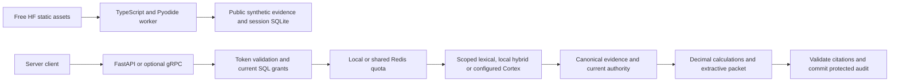
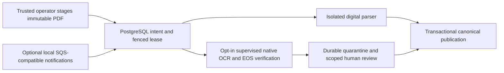

# CreditLens High-Level Design

## Implemented demonstration

The free HF Space serves the TypeScript workbench and pinned Pyodide runtime. The Python lexical
workflow runs in a browser worker with public fictional evidence and session SQLite. It needs no
tunnel or owner computer. Browser scope checks are for demonstration only; confidential evidence
must never be shipped as an asset.

The FastAPI server shares the same core logic and adds managed identity, optional hybrid retrieval,
shared SQL catalog, Redis ID caching and digital ingestion workers. An opt-in process-local response
cache skips repeated retrieval/calculation while reauthorizing, validating exact current sources and
recording a fresh audit. Local OTel, Prometheus and Grafana are implemented. The provisioned
dashboard has 20 operational, six evaluation and six indexing panels, plus six alert rules. Hosted
monitoring and notification routing remain operator work. See
[monitoring](../infra/monitoring/README.md). AWS is an optional documented deployment and no
resources have been provisioned. The flows below describe implemented browser, server and
trusted-operator paths.

The local demo can opt into PostgreSQL on its grant/audit database. That path shares canonical
evidence and revocation between API instances. Redis integrations remain optional. Actual-service
tests cover cross-instance cache reuse, revocation, restart and audit rejection during a concurrent
change. Optional shared Redis quotas enforce admission across API instances with fail-closed outage
behavior and expiring opaque identity counters. Demo bootstrap privileges and production deployment
validation still limit production scaling.

Scanned-document work runs in a separate local CPU environment. A bounded Poppler container renders
physical pages, and pinned PaddleOCR-VL 1.6 with PP-DocLayoutV3 produces layout and recognized text
for review. OCR artifacts retain source hashes and scope but receive zero extraction confidence
until reviewed; they cannot enter retrieval automatically. A scoped administrator can inspect the
durable artifact and approve corrected text through the API or CLI. Canonical publication and the
review decision commit together. An opt-in native OCR worker now executes trusted staged jobs,
verifies observed EOS completion and commits REVIEW_REQUIRED. Its Windows model process is
supervised but has no filesystem sandbox. Public untrusted-file upload and automatic approval remain
unavailable. See [OCR experiments](../infra/ocr/README.md).

The durable ingestion store now uses PostgreSQL for intent, idempotency, leases, retries, review
state and completion. A worker's expired token cannot publish. Digital evidence and completed job
status share one transaction, with the current admin grant locked through commit. Opt-in admin HTTP
routes register staged source hashes and read durable status with current grants. Local source
storage separates tenants and verifies immutable PDF bytes. Digital workers parse one source in a
network-disabled Docker container, recheck grants on heartbeats and publish only validated output.
An optional boto3 adapter now sends and consumes job notifications through a local SQS-compatible
broker. The opt-in API sends notifications after committing intent. A persistent worker consumes
them, acknowledges terminal jobs and recovers SQL work on empty polls or broker outages. Shutdown
intent prevents a new claim after a pending broker poll and preserves its notification. Managed SQS
deployment and object storage remain unfinished. The database remains authoritative for source
identity and permissions.

## Query flow

The public browser uses the first branch. It does not call the server, managed Cortex or local model
process. The optional Supabase directory supplies only five public fictional borrower labels and
falls back to bundled labels. Its client and PostgreSQL permissions were tested locally; no hosted
Supabase project is claimed. See [directory setup](../infra/supabase/README.md).

## Ingestion flow

SQL polling recovers work when notifications are absent or the broker fails. A notification cannot
supply source identity, permissions or publication authority.

## Retrieval and backfill experiments

The local hybrid experiment combines lexical and dense retrieval, rank fusion, cross-encoder
reranking and selective query grounding. FAISS and Weaviate HNSW have separate
actual-service/numerical experiment records. FAISS top-10 sets matched exact NumPy for all 235
permitted searches. Four Weaviate configurations were measured with retained IDs and duplicate
counts; none justified promotion. Spark local[1]/local[2] backfill matched serial Python output on
the canonical corpus and tenfold replay, but Python remained faster at this scale.

These experiments do not change the lexical browser runtime. See
[retrieval](../infra/retrieval/README.md), [Weaviate](../infra/weaviate/README.md) and
[Spark](../infra/spark/README.md). OpenSearch and Cortex adapter contracts remain separate from live
managed-service deployment evidence.

Optional read-only GraphQL exposes scoped administrator metadata; the versioned gRPC transport
reuses the authenticated workflow, quota and protected audit. Both were tested locally. Neither
creates a new production service boundary.

## Trust boundaries

1. Browser is untrusted.
2. Identity-provider token is verified by backend.
3. Tenant and ACL scope are derived from trusted application state.
4. Search filters are constructed server-side.
5. LLM never controls authorization scope.
6. General logs/traces avoid raw sensitive document content.

## Local hybrid request integration

The provider layer can compose scoped local ranking, lexical/dense rank fusion and a bounded
reranker. Every model boundary preserves current canonical evidence and SQL grant checks; reranking
retains the underlying branch snapshots. The default local build and public browser remain lexical.
The optional local Linux CPU runtime verifies pinned model files and loads models during startup. It
bounds scoring concurrency and retained document vectors. Composed evaluation and public deployment
are separate promotion steps. The Linux container reproduced all 240 frozen rankings and workflow
outcomes. Offline model results are reported separately from HTTP performance and semantic answer
quality.

The completed packet evaluation is a reconciled raw diagnostic, with 102/235 passes and 8/8
controls, not human-validated accuracy. Operational dashboards, raw evaluation diagnostics and
indexing snapshots remain separate. Actual proxy checks verified six indexing and two packet
expressions; runtime unknown cost never enters the cost histogram as zero. See
[evaluation](evaluation.md).

A one-test [PostgreSQL restore drill](recovery.md) preserved 330 canonical rows, audits and saved
revocations. Revocations made after a backup can be lost on restore and require reconciliation
before reopening. Shared Redis quota recovery has separate contention/expiry evidence; it does not
restore SQL authority.
