# CreditLens system design

## Scope and deployed system

CreditLens prepares cited evidence for a commercial-loan underwriter. The request contains a
borrower, question and effective policy date. The workflow computes financial metrics, reports
missing or conflicting evidence and leaves the lending decision with the underwriter.

The live free Hugging Face release serves static TypeScript assets and a pinned Pyodide worker.
Public synthetic evidence and session SQLite run in the browser; queries and source inspection work
offline after startup. Release `e964da2860f2ff4f7f5987e1986adb9457563fbd` was built from source
`3960981`. The browser has no server credentials and cannot protect downloaded evidence. The
optional Supabase client reads only public fictional directory labels; the current release uses
bundled labels. Hosted Supabase remains operator setup.

The FastAPI modular monolith is a separate server path. It owns token verification, current SQL
grants, scoped retrieval, deterministic Decimal calculations, exact citation validation and
protected audits. The governed Cortex composition is implemented and tested with real local SQL and
signed synthetic tokens, with simulated remote search. No live managed identity/search or AWS
deployment is claimed. The expanded PRD still contains unverified and operator-only work.

## Request and authority flow

```mermaid
flowchart LR
  Request[Strict query request] --> Auth[Authenticate and resolve current SQL grants]
  Auth --> Quota[Configured local or shared Redis quota]
  Quota --> Scope[Canonical borrower, ACL and effective-date candidates]
  Scope --> Cache[Optional scoped response cache]
  Cache --> Search[Lexical or configured retrieval]
  Search --> Finance[Extract facts and calculate with Decimal]
  Finance --> Validate[Validate exact citations and current authority]
  Validate --> Audit[Commit protected audit]
  Audit --> Packet[Underwriting packet]
```

A response-cache hit still validates current evidence and authority, receives a fresh request ID and
writes a new audit. Source inspection repeats authorization; a citation ID grants no access. A
failed audit or changed authority rejects the result. Search indexes provide candidate IDs and
ranking, while the canonical catalog supplies trusted source text and scope.

The API serves query and packet aliases, scoped evidence, borrower choices, privileged
staged-ingestion/review routes, health/readiness and admin-only metrics. An omitted effective date
defaults to today. Admin submissions require an idempotency key and return a durable job ID with
HTTP 202. They accept staged source intent rather than a public PDF upload.

Optional gRPC reuses the same authenticator, workflow, quota and audit contract through bounded
versioned protobuf messages. The local transport has actual socket tests for signed tokens,
deadlines, scope, revocation, quotas and serialization. Optional read-only GraphQL bounds query
expansion, checks current admin grants and returns scoped catalog/job metadata and the caller's
audit metadata. Document text, protected packets and other subjects' audits are excluded.

## Storage, caching and shared admission

SQLite supports isolated demos and browser sessions. Optional PostgreSQL stores current grants,
canonical evidence, catalog epochs, protected audits and durable job state. Publication and
revocation invalidate old epochs across instances. Immutable local PDF storage binds tenant, source
hash and exact staged bytes. Managed object storage is an operator deployment requirement.

The per-workflow response LRU holds at most 512 immutable packets. Redis retrieval caching stores
signed evidence IDs and rehydrates current canonical pages. Both are optional acceleration; neither
supplies permission authority. Response-cache stampede suppression is not implemented.

A separate quota Redis URL enables shared fixed-window admission. One atomic Lua script
checks/increments a full SHA-256 subject key and attaches its initial TTL. Workers must share
namespace, limit and window settings. A bounded Redis memory configuration with noeviction rejects
capacity pressure instead of evicting allowance state. Quota errors return 503 with no local
fallback or ambiguous-write retry; exhausted allowances return 429. TTL expiry and reconnection
recover without application restart. Nonpersistent Redis restarts reset counters, so this is not a
durable billing ledger. Retrieval-cache errors may recompute authorized work.

## Retrieval and deterministic output

The default server and public browser use lexical retrieval. The optional local CPU workflow
verifies pinned embedding/reranker files, fuses lexical and dense ranks with RRF, reranks bounded
candidates and applies selective query grounding. It preserves canonical evidence and current grants
through every model boundary. The serving packet remains extractive and rule based. Local language
models are used for evaluation rather than final lending decisions.

The 220 eligible development questions measured 74.05% Recall@10 and .6775 nDCG@10 for lexical
retrieval, compared with 86.54% and .7878 for the composed local workflow. The corpus has 3,840
physical pages from 203 synthetic PDFs and 98 short templates. Labels were exposed during
development. Original resume targets and production generalization are not established by this
experiment.

FAISS, exact NumPy and Weaviate HNSW have separate retained-ID comparisons. FAISS matched exact
top-10 sets on all 235 permitted searches. Four Weaviate settings completed with lower relevance and
recorded duplicate IDs; they were not promoted. Spark local backfill and serial Python matched
canonical metadata on the corpus and tenfold replay. Python was faster at this scale. These are
measured experiment paths, not services used by every live browser query.

## Durable ingestion and reviewed OCR

SQL holds immutable intent, idempotency, bounded retries and fenced leases. A digital worker
receives one read-only source in a network-disabled container, checks current grants on heartbeats
and validates extracted output before commit. Canonical pages, the catalog epoch and completed
status publish in one transaction. Lease loss or changed grants prevent stale publication.

Optional local SQS-compatible notifications identify jobs; SQL remains recovery authority when
delivery is duplicated, missing or unavailable. Managed AWS queue configuration has not been
deployed.

The opt-in native OCR worker renders staged PDFs in the bounded Poppler container, supervises
PaddleOCR-VL recognition and independently verifies observed EOS tokens. Successful recognition
commits REVIEW_REQUIRED with zero admission confidence. A scoped reviewer may correct text and
approve or reject a hash-bound artifact; reviewer and original submitter grants remain locked
through publication. The native Windows model process is supervised but lacks a filesystem sandbox,
so this path accepts trusted synthetic/operator inputs. Public untrusted-file upload and automatic
approval remain unavailable. One retained financial fixture matched 15/15 table cells and 8/8
numeric cells; this is not a general OCR accuracy result.

## Measurement and operations

Local OTel exports allowlisted traces and finite metric labels. Admin-only Prometheus scraping feeds
23 operational, six evaluation and nine indexing panels Grafana panels, plus six alert rules. Four
SQL gauges cover retained job counts, attempts, oldest state age and expired leases. A local drill
returned SQL-backed data through all five ingestion panels and fired backlog/expired-lease alerts
after explicit timestamp injection. Hosted alert delivery, production incident response, drift
review and human feedback remain operator or evaluation work. Runtime cost counters/histograms
distinguish known and unknown values; unknown costs never enter the histogram as zero. Evaluation
dashboards expose recorded diagnostics separately from operational transport observations.

Two Python API processes sharing PostgreSQL were measured at concurrency 1, 4 and
8. HTTP p95 was 86.40, 99.20 and 300.17 ms, with 360 unique audited successes across
warmups and measured traffic. Throughput fell at concurrency eight. Shared-quota verification is a
later separate test, not a reinterpretation of that load run. The response-cache repeat measured
23.14 ms disabled and 22.67 ms warm serial loopback p95. Neither test establishes the original cloud
latency/cost targets.

The 240 authored workflow checks are deterministic outcomes. The separate completed RAGAS
field-support run accounts for 235 packets and five denials: 2,963/2,965 supported occurrences from
441 unique actual prompts. One arithmetic judge error accounts for both rejected occurrences; raw
verdicts remain intact. This measure omits question relevance, advice and human calibration. The
completed whole-packet DeepEval v2 reconciliation accounts for all 240 ledger cases: 235 packets
graded and five authorization denials. It retains 102/235 raw passes (43.4%) and 8/8 controls, with
`human_calibrated=false` and `validated_project_quality=false`. A recorded recovery reused 192
completed packet judgments and graded 43 previously unstarted cases after allowing their unchanged
empty evidence lists. No completed verdict was replaced. The 12-case agent review found disputed
omissions, period checks and overlooked structured fields. This is a raw diagnostic rate, not
reliable accuracy or a resume quality claim.

Actual RAGAS journal counts total 538,444 prompt and 65,932 completion tokens; these are
model-reported observations, not cloud dollar cost. The local indexing drill acknowledged 3,840
chunks in 0.957 seconds and observed a canary searchable 0.990 seconds after acknowledgement
processing. One deliberately invalid write was rejected separately. This snapshot does not measure
continuous production freshness or a natural model-error rate.

A separate PostgreSQL backup/restore drill passed one test, preserving 330 canonical rows, protected
audits and revocations present in the snapshot. Revocations made after the backup can be lost on
restore; reconciliation before reopening service is required by the [recovery runbook](recovery.md).
Shared Redis admission/recovery has separate 24-test evidence; it does not restore authoritative
database state.

## Deployment decisions and references

A modular monolith keeps authority, calculation, validation and audit ordering inspectable. More
replicas require measured SQL/provider contention and consistent shared quota configuration. AWS
ECS/ALB, Cognito, S3 and managed service guides are optional operator paths under the no-spending
instruction, not existing resources. The modeled 50-underwriter workload is a design assumption, not
observed adoption.

See [HLD](HLD.md), [LLD](LLD.md), [performance](performance.md), [multi-instance
verification](multi-instance.md), [delivery](delivery.md), [Redis](../infra/redis/README.md),
[OCR](../infra/ocr/README.md), [monitoring](../infra/monitoring/README.md),
[retrieval](../infra/retrieval/README.md), [Weaviate](../infra/weaviate/README.md),
[Spark](../infra/spark/README.md), [gRPC](../infra/rpc/README.md) and
[Supabase](../infra/supabase/README.md).

The later local publication experiment verified all 3,840 SQL canonical payloads and exact
searchable text in 4.890 seconds after publication, using 39 search requests. SQL publication took
32.057 seconds separately. The actual pinned CPU neural drill recorded one document-embedding
invocation, three query-embedding invocations including one injected failure, and one rerank
invocation. Recovery reproduced the original ranking, and all three neural Grafana panels were
verified. These checks extend the earlier canary snapshot; they do not establish continuous
production freshness or a natural model-error rate. The bundle now contains 38 panels: 23
operational, six evaluation and nine indexing. See [publication
visibility](../infra/monitoring/publication-visibility.md) and [neural operation
monitoring](../infra/monitoring/neural.md).
